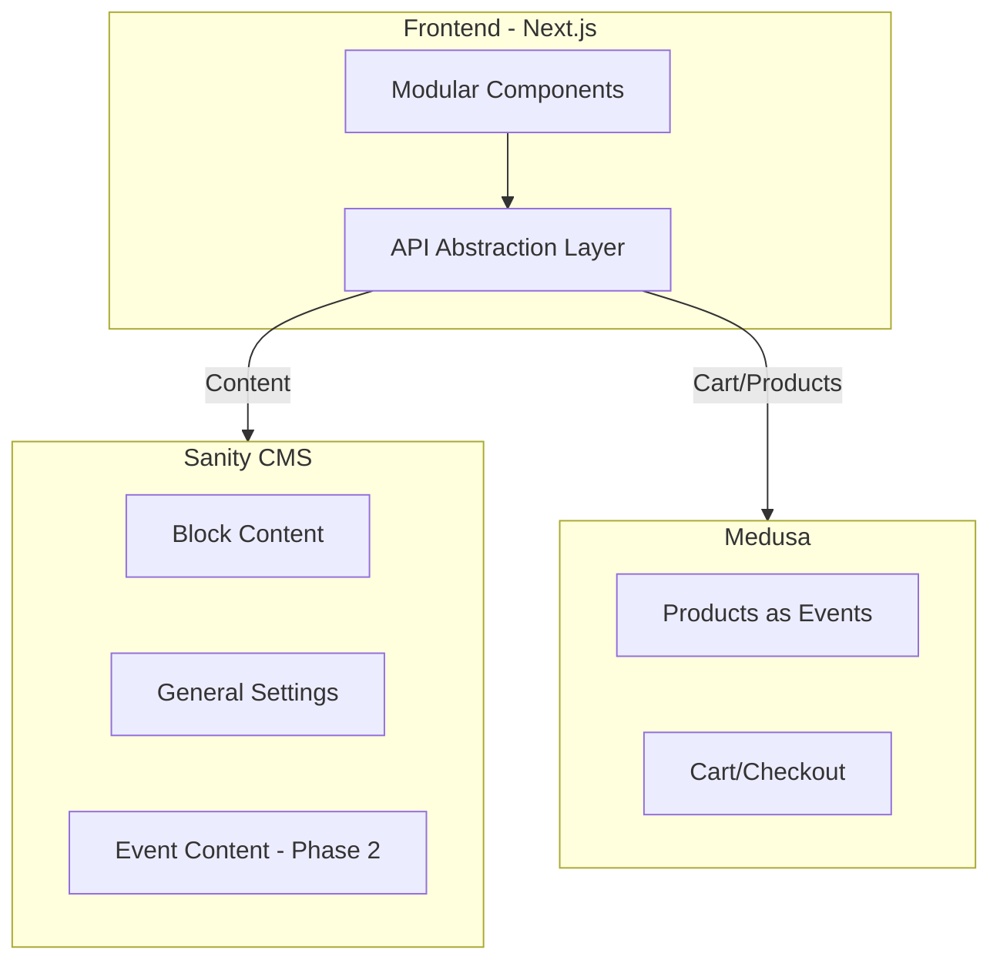

# Vrije Academie — Project Overview

This repository contains three separate projects for the Vrije Academie events website:

- **Sanity** — Content Management System (CMS)
- **Frontend** — Next.js frontend application
- **Medusa** — E-commerce backend for events

Each project is in its own folder and can be managed as a separate git repository.

## Architecture



The frontend communicates with both Sanity and Medusa through abstraction layers, allowing either backend to be swapped (e.g., Sanity → Contentful, Medusa → Shopify) without rewriting the application.

## Project Structure

```
site/
├── sanity/      # Sanity Studio + schemas
├── frontend/    # Next.js + Tailwind
└── medusa/      # Medusa backend
```

## Quick Start

### Prerequisites

- Node.js 18+
- PostgreSQL (for Medusa)
- Redis (for Medusa)
- Sanity account (for CMS)

### Setup Each Project

Each project has its own setup instructions:

1. **Medusa** — See [medusa/docs/README.md](./medusa/docs/README.md)
2. **Sanity** — See [sanity/docs/README.md](./sanity/docs/README.md)
3. **Frontend** — See [frontend/docs/README.md](./frontend/docs/README.md)

### Development Workflow

1. Start Medusa backend:
   ```bash
   cd medusa
   npm install
   npm run dev
   ```

2. Start Sanity Studio:
   ```bash
   cd sanity
   npm install
   npm run dev
   ```

3. Start Frontend:
   ```bash
   cd frontend
   npm install
   npm run dev
   ```

## Project Documentation

### Medusa (`medusa/`)

E-commerce backend for managing events as products.

- [README.md](./medusa/docs/README.md) — Setup and overview
- [EVENTS.md](./medusa/docs/EVENTS.md) — Event metadata structure
- [OPEN_POINTS.md](./medusa/docs/OPEN_POINTS.md) — Future considerations

**Cursor Rules**: `.cursor/rules/medusa-events.mdc`

### Sanity (`sanity/`)

Content Management System with block-based page building.

- [README.md](./sanity/docs/README.md) — Setup and overview
- [BLOCKS.md](./sanity/docs/BLOCKS.md) — Block catalog
- [blocks/](./sanity/docs/blocks/) — Individual block documentation
- [OPEN_POINTS.md](./sanity/docs/OPEN_POINTS.md) — Future considerations

**Cursor Rules**: 
- `.cursor/rules/sanity-schema.mdc`
- `.cursor/rules/sanity-groq.mdc`

### Frontend (`frontend/`)

Next.js application with Tailwind CSS and VA design system.

- [README.md](./frontend/docs/README.md) — Setup and architecture
- [DESIGN_SYSTEM.md](./frontend/docs/DESIGN_SYSTEM.md) — Design tokens and components
- [OPEN_POINTS.md](./frontend/docs/OPEN_POINTS.md) — Future considerations

**Cursor Rules**:
- `.cursor/rules/frontend-components.mdc`
- `.cursor/rules/frontend-api.mdc`

## Design System

The frontend follows the Vrije Academie design system:

- **Colors**: Black, white, light gray base with yellow/gold accents and purple labels
- **Typography**: Serif (Playfair Display) for headings, Sans (Source Sans 3) for body
- **Layout**: Grid-based, magazine-style with generous white space
- **Components**: Modular, reusable components following VA principles

See [frontend/docs/DESIGN_SYSTEM.md](./frontend/docs/DESIGN_SYSTEM.md) for complete reference.

## Key Features

### Block-Based CMS

Sanity provides a flexible block system where pages are built from reusable content blocks:
- Hero sections
- Rich text content
- Images
- Multi-column layouts
- Content cards
- Call-to-action blocks
- Event listings

Each block is configurable with margins, width, and background colors.

### Event Management

Events are managed in Medusa as products with:
- Online and offline event types
- Date/time scheduling
- Capacity management
- Ticket variants (standard, early bird, etc.)
- No shipping (events are experiences)

### API Abstraction

Both CMS and Commerce are abstracted behind interfaces:
- Easy to swap backends
- Type-safe APIs
- Consistent patterns across the application

## Environment Variables

Each project requires its own environment variables. See each project's README for details:

- **Medusa**: Database, Redis, JWT secrets
- **Sanity**: Project ID, dataset
- **Frontend**: Sanity project ID, Medusa backend URL

## Development Notes

- Each project can be developed independently
- Changes to one project don't require rebuilding others
- All projects use TypeScript for type safety
- Cursor rules are configured for each project

## Future Enhancements

See each project's `OPEN_POINTS.md` for future considerations:

- Multi-language support
- Authentication and member areas
- Enhanced search functionality
- Analytics and tracking
- Performance optimizations

## License

ISC
